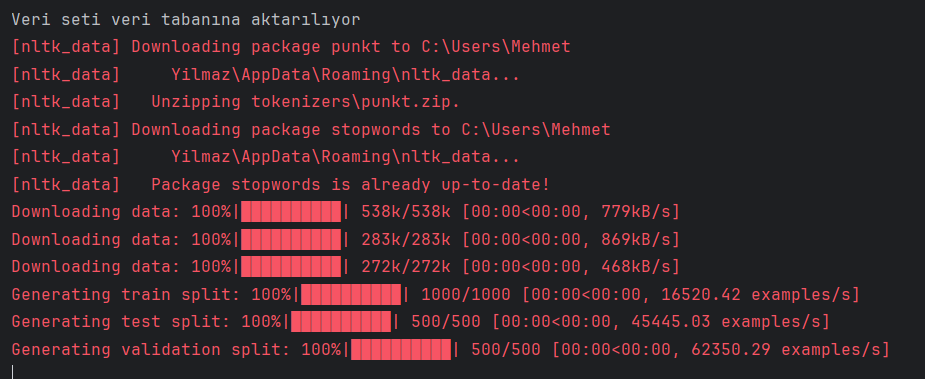

# Academic Article Recommendation System

Flask ve MongoDB tabanlı, akademik makaleler için içerik bazlı bir öneri sistemi. FastText ve SciBERT vektörleri kullanılarak kullanıcı ilgi alanlarına göre INSPEC veri setinden makale önerileri sunar ve iki yöntemin başarımını precision metriği ile karşılaştırır.

## Özellikler

- Kullanıcı kayıt/giriş sistemi
- İlgi alanlarına göre kullanıcı profili oluşturma
- FastText ve SciBERT tabanlı kosinüs benzerliği ile makale önerisi
- Beğenilen makalelere göre kullanıcı ilgi vektörünün güncellenmesi
- FastText vs. SciBERT öneri başarımının precision karşılaştırması

## Gereksinimler

- Python 3.x
- MongoDB (yerelde çalışıyor olmalı)
- `cc.en.300.bin` FastText modeli (Facebook FastText sayfasından indirilmeli)

```
pip install pymongo torch transformers scikit-learn flask fasttext nltk datasets numpy
```

Tarayıcıdan `http://localhost:9000` adresine gidin.

## Notlar

- İlk çalıştırmada INSPEC veri seti indirilir ve tüm makaleler için vektörler hesaplanır, bu işlem biraz zaman alabilir.
- Proje eğitim/araştırma amaçlı geliştirilmiştir.


